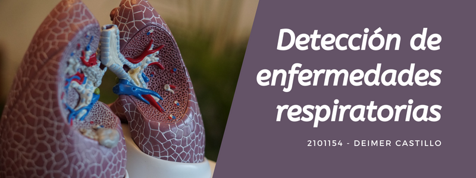

# Detección de enfermedades respiratorias
---

---
- Autor: Deimer Ivan Castillo Caceres

- Objetivo: Construir un modelo que clasifique enfermedades respiratorias a partir de características de grabaciones de sonidos respiratorios.

- Dataset: [Respiratory Sound Database](https://bhichallenge.med.auth.gr/)

- El dataset consta de un total de 5,5 horas de grabaciones que contienen 6.898 ciclos respiratorios, de los cuales 1.864 contienen crujidos, 886 contienen silbidos y 506 contienen tanto crujidos como silbidos, en 920 muestras de audio anotadas de 126 pacientes.

- Los ciclos fueron anotados por expertos en respiración para determinar si incluían crujidos, sibilancias, una combinación de ellas o ningún sonido respiratorio adverso.

- Las grabaciones se recogieron con equipos heterogéneos y su duración osciló entre 10 y 90 segundos. También se indican las localizaciones torácicas de las que se obtuvieron las grabaciones. Los niveles de ruido en algunos ciclos respiratorios son elevados, lo que simula las condiciones de la vida real.

- Modelos: Convolutional Neural Networks
- Slides: [Google Slides](https://docs.google.com/presentation/d/1JSX_imFIj0OVu_Jfn5q9zrYS4EQqPDoyb7RTmURFjvk/edit?usp=sharing)